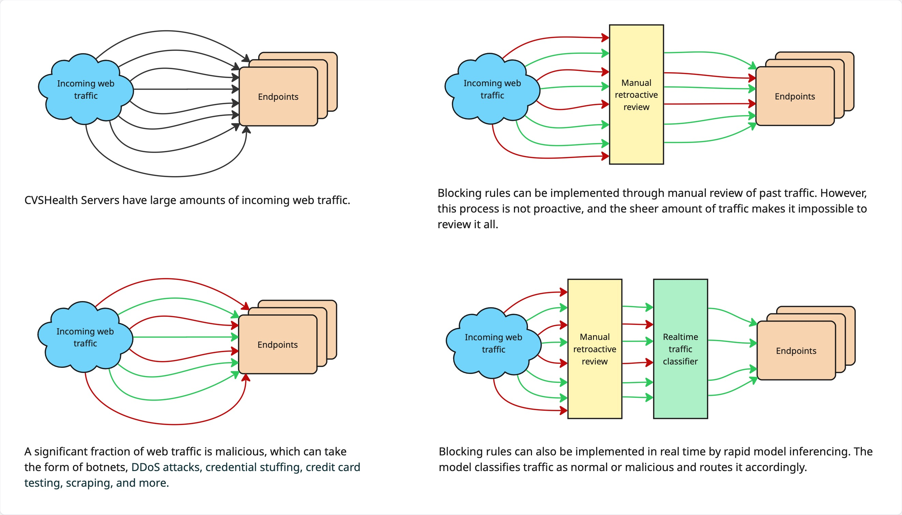
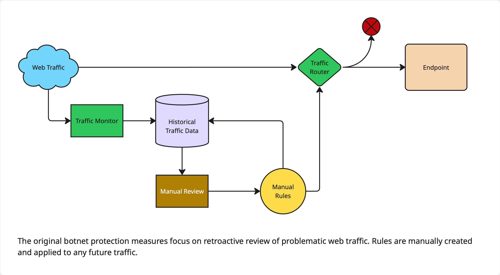
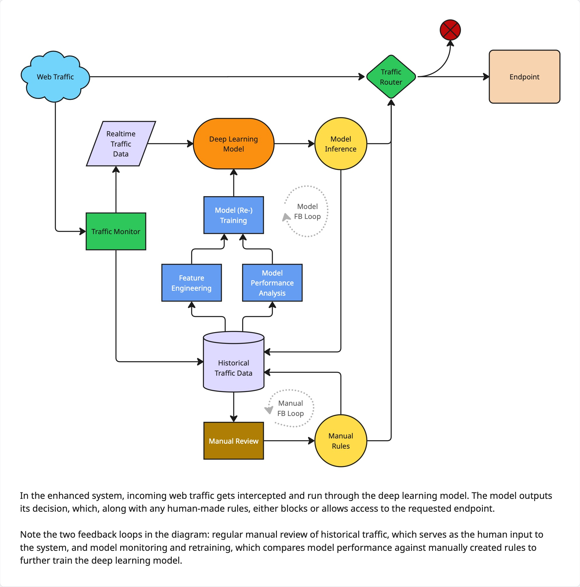
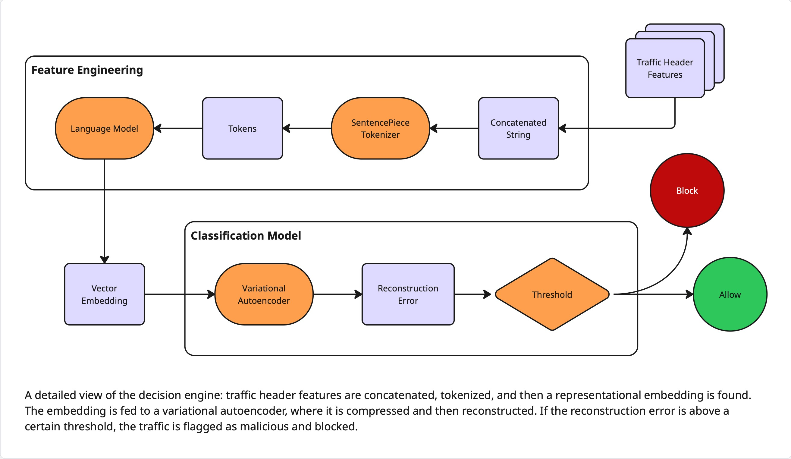

# CVSHealth Botnet Shield Case Study

A significant portion of modern web traffic consists of malicious activity, including credential stuffing, DDoS attacks, card testing, and large-scale scraping. These threats lead to costly problems such as fraud, account takeovers, and data breaches. This case study describes the implementation of a machine learning system designed to detect and block automated malicious requests targeting customer-facing endpoints, while safeguarding legitimate user experience and platform availability.

 
## Use Case and Desired Outcome

The project’s aim was to distinguish and block automated malicious traffic from legitimate human users by leveraging HTTP header features, such as user agents, referrer URLs, authentication tokens, and cookies. The system’s primary goals were to reduce fraud incidents, prevent account takeovers, limit scraping, and free the cybersecurity team up to focus on proactive threat hunting, all without interrupting legitimate customer access.

 
## Business Alignment

Attacks against CVS Health’s online infrastructure lead to direct financial losses from fraud and account compromises, along with inflated infrastructure costs due to excessive bot traffic. Automating malicious traffic detection mitigates these losses, reduces manual investigations, and lowers costs from unnecessary scaling. More importantly, it protects customer accounts, helping to maintain trust; a key operational priority for the business.

 

 
## Plan of Attack

The team began with a cybersecurity-provided list of 100+ endpoints, ranking them by traffic volume and data quality. Endpoints were filtered to those with sufficient data for training but manageable scope for pilot testing, resulting in seven e-commerce–related endpoints being selected. Historical logs and previously established blocking rules were used to develop and validate detection models.

Feature engineering proved central to the project. For each web request, all available request headers were concatenated into a single string, treating them as text sequences. The objective of the next few steps was to obtain a dense vector representation of the concatenated string using a language model. Recognizing that these strings consisted of words, symbols, and numbers instead of natural language, a subset of these data was taken and used to train a SentencePiece tokenizer. This allowed efficient tokenization of the concatenated strings. With the strings tokenized, the same corpus was used to train a small language model, which was in turn used to obtain vector embeddings.

Initial feasibility tests applied unsupervised clustering and dimensionality reduction on these embeddings. The embeddings were projected into UMAP space and historical labels overlaid post-hoc, with distinct malicious traffic clusters emerging with clear separation. Cluster separation quantified via silhouette scores demonstrated a potential 20-30% improvement in malicious traffic detection.  

With the feasibility of unsupervised classification proven, data pipelines for training data were prepared for each of the seven endpoints. A variational autoencoder deep learning model was designed, and training and hyperparameter tuning pipelines were set up for each of the seven endpoints. Trained models were tracked in MLFlow, deployed with Databricks Model Serving, and integrated into Splunk for live inferencing and security triage.

 
## Success and Challenges

UMAP visualizations showed distinct latent space regions dominated by malicious traffic (>90% purity in top clusters via post-hoc labels), confirming embeddings captured separable signals for variational autoencoder anomaly detection. Production models, each trained for a specific endpoint on six months of data and served with Databricks, integrated successfully into Splunk with phased rollout, providing real-time bot scores for security triage.

Unfortunately, some advanced bots fell into ambiguous latent regions, evading high reconstruction error thresholds. Seasonal traffic surges (e.g., promotions) may have produced false anomalies; this will require a deeper look into threshold tuning.

 
## What Worked Well

- Unsupervised UMAP PoCs provided rapid visual proof, expediting stakeholder buy-in.
- Model metrics displayed on realtime dashboards also gained stakeholder buy-in while supporting the case for regular model retraining.
- Feature engineering blending header information signals outperformed manual rulesets.

 
## Issues Faced

- Large size of training data required careful design of feature engineering processes and tradeoffs between simplicity, speed, reliability, and cost.
- Endpoint prioritization tradeoffs caused scope tension.
- Traffic surges were occasionally interpreted as bots.
- Balancing aggressive blocking with user accessibility required ongoing tuning.

 
## Takeaways

- Using unsupervised learning can provide a model with flexibility beyond the story labeled data tells. This approach excels for zero-day threats and drift in adversarial domains.    
- Visual demonstrations (UMAP visualizations) build security team trust faster than purely numerical metrics.
- Ongoing model monitoring and retraining are essential as attackers are constantly evolving.
- Building in a human feedback loop alongside a continuous learning ML feedback loop is a very powerful system design to constantly improve an ML model.
- SentencePiece tokenizers can be trained to tokenize arbitrary byte-like or text-like data, making them suitable for mixed header fields.
